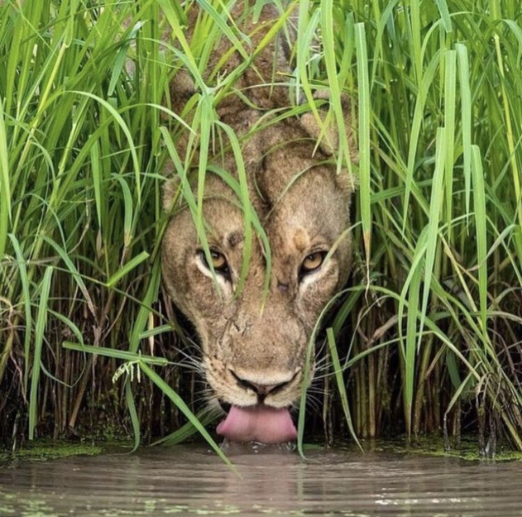

# This project is a Convolutional Neural Network Visualizer for visualizing outputs from inner convolutional layers within a CNN model.

   
[*Image Source*](https://i.pinimg.com/originals/73/fd/d4/73fdd4752a176af8f388b31a67e93d87.jpg)

## Project folder includes
1. Readme.md (this file)
2. Google colab notebook for visualizing the CNN layer outputs on the Cool Cat image
3. Misc
    - Cool Cat Image - 
    In Zambia’s South Luangwa National Park, a photographer had been watching a pride of lions while they slept off a feast from a buffalo kill. When this female walked away, he anticipated that she might be going for a drink and so he positioned his vehicle on the opposite side of the waterhole. The cool cat picture is one of the highly commended 2018 Image from Wildlife Photographer of the Year.
  
## Programming language and Libraries used
1. Python programming language
2. Deep learning libraries tensorflow 2.x and Keras API
3. Python libraries including numpy, etc

## Notes
1. Purpose of this project is to demonstrate how to use the functional api in keras to visualize outputs from inner layers within a CNN.
