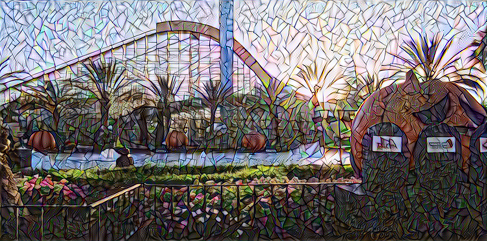

# Neural Style Transfer using TensorFlow
Neural Style Transfer is a technique for generating new artistic images from existing content and style images. This project uses an unsupervised deep learning algorithm for performing neural style transfer.

## Programming Language and Libraries used 
1. Python 3.x 
2. Tensorflow 2.x and Keras API 
3. Other python libraries like Numpy, OpenCV 

## Notes 
1. <a href='https://medium.com/@vasu.gupta9/neural-style-transfer-using-tensorflow-7e0f3e789e0c' > Link </a> to Medium Article presenting the main ideas and implementation details of Neural Style Transfer using TensorFlow 

